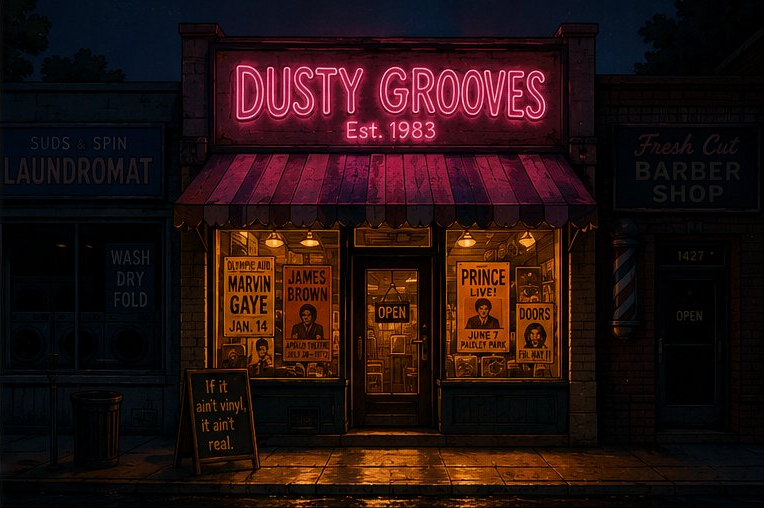
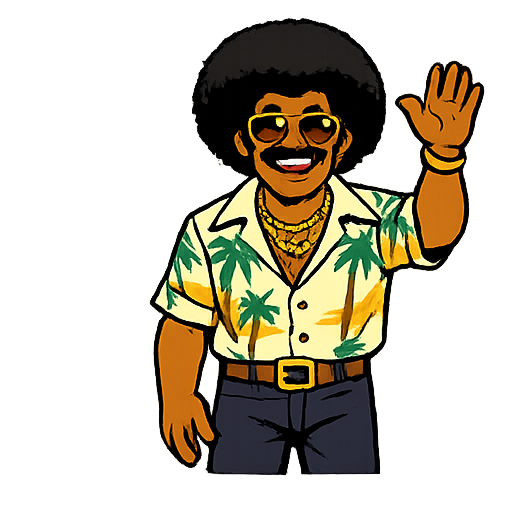
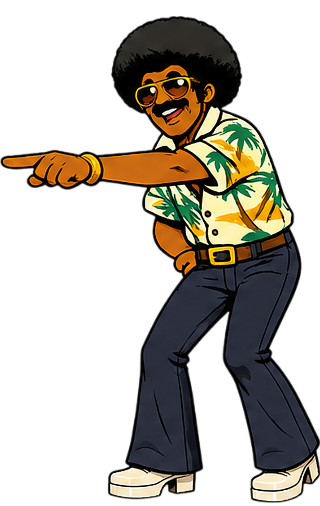
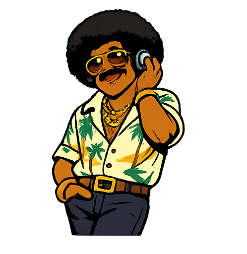
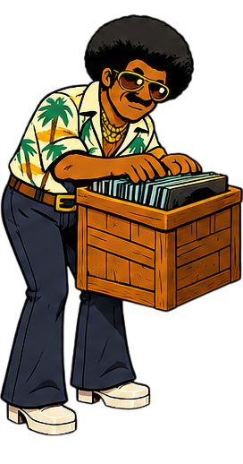
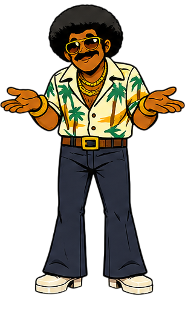
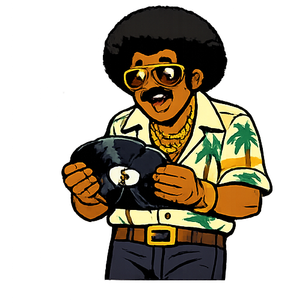
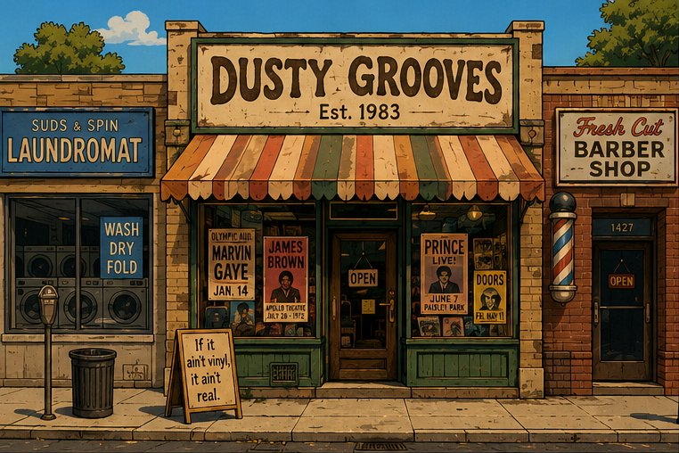
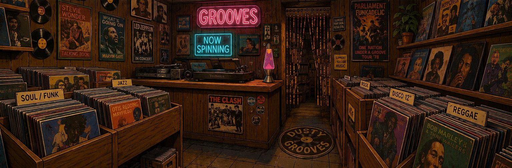

<p align="center">
  
</p>

<h1 align="center">🎵 Dusty Grooves</h1>
<h3 align="center">Est. 1983 - A record shop that time forgot</h3>

<p align="center">
  
  
  
</p>

---

## The Shop

Somewhere on a quiet side street, wedged between a laundromat and a barber shop, there's a place that never moved on from 1983.

The neon sign still buzzes. The same guy is still behind the counter. The same music is still on the turntable. The world went digital. Dusty Grooves didn't.

You open the app and you're standing outside the shop. Maybe it's a warm afternoon and the sun is hitting that faded awning. Maybe it's late at night and the only light on the block is the hot pink neon glow of **DUSTY GROOVES** bleeding onto the wet sidewalk. Either way, you found it.

You tap to walk in.

---

## 🕶️ Meet Big Tony

<p align="center">
  
</p>

Big Tony opened Dusty Grooves in 1983 and never left.

The world moved to CDs, then MP3s, then streaming. Tony didn't. He's not bitter about it. He's proud. Every record in his shop is a masterpiece, and he'll tell you why. He calls everyone *"my friend."* He's a local legend.

He greets you like you're a regular, even if it's your first time.

> *"Welcome to Dusty Grooves, my friend!"*

Search for a song, and Tony points you to the right crate. Pick a track, and the vinyl hits the turntable. Tony leans back, presses a headphone to his ear, closes his eyes, and vibes. That's it. That's the app.

No accounts. No playlists. No algorithms. Just a man, his shop, and the music.

<p align="center">
  
  
  
</p>

---

## 🎶 What Happens When You Walk In

```
You open the app
    ♫  The shopfront. Day or night. Big Tony at the door.

You tap to enter
    ♫  You're inside. Wood panels, neon signs, crates of vinyl everywhere.
    ♫  Tony waves. "Welcome to Dusty Grooves, my friend!"

You search for a song
    ♫  Tony perks up, points at the record wall.
    ♫  He digs through the crates while results load.

You pick a track
    ♫  Vinyl slides onto the turntable and starts spinning.
    ♫  Album art on the label. "NOW SPINNING" sign lights up.
    ♫  The music plays. Tony vibes.

Can't find it?
    ♫  Tony shrugs. "Can't find that one, my friend. Try another?"

Something broke?
    ♫  Tony holds up a cracked record, looking at it with comic dismay.
    ♫  "Even the best records skip sometimes."
```

<p align="center">
  
  
</p>

---

## 🌙 Day & Night

This isn't a theme toggle. It's time of day at Dusty Grooves.

<p align="center">
  
  
</p>

**Daytime** - warm sunlight, faded awning, a sandwich board outside that reads *"If it ain't vinyl, it ain't real."* The shop looks lived-in, sun-bleached, and loved.

**Nighttime** - the neon kicks in. Hot pink sign glowing. Warm golden light spilling from the windows onto an empty sidewalk. The street is dark and quiet. Dusty Grooves is the only light on the block. It feels like discovering a secret.

---

## 🔧 Under the Hood

Dusty Grooves is built with love, free APIs, and zero budget.

| What | How |
|------|-----|
| **The bones** | React + Vite |
| **The style** | Tailwind CSS with a custom 80s palette - hot pink neons, electric cyan, deep purple shadows, warm cream daylight |
| **The movement** | Framer Motion for pose transitions and page animations. CSS keyframes for the ambient stuff - neon flicker, CRT scanlines, vinyl spin, idle bob |
| **The music info** | Last.fm API - song metadata, album art, artist info. Free with an API key |
| **The sound** | Piped API - audio-only streams, no video data. Keeps it light on mobile data |
| **The playback** | Plain HTML5 `<audio>` element. No libraries, no bloat |
| **Big Tony & the shop** | Dreamed up in the neon dream machine. Six character poses, three shop environments |
| **The home** | GitHub Pages. Free |

**Total cost: $0**

---

## 🎨 The Palette

<p align="center">
  
  
  
  
  
  
  
</p>

| Colour | Hex | Usage |
|--------|-----|-------|
| Hot Pink | `#FF006E` | Neon signs, active states, the glow |
| Electric Cyan | `#00F5D4` | Highlights, hover states, "NOW SPINNING" |
| Deep Purple | `#3D0066` | Shadows, depth, nighttime |
| Neon Orange | `#FF6B00` | Warmth, accents |
| Near Black | `#0A0010` | The night |
| Warm Cream | `#FFF5E1` | The daylight |
| Wood Brown | `#5C3D1A` | The counter, the crates, the walls |

---

## 📂 The Shop Layout

```
dusty-grooves/
├── public/
│   └── images/               <- Big Tony (6 poses), shop (3 scenes), vinyl SVG
├── src/
│   ├── components/
│   │   ├── ShopExterior       <- The landing - day or night
│   │   ├── ShopInterior       <- Inside the shop - where the music lives
│   │   ├── BigTony            <- The man himself, state-driven poses
│   │   ├── SpeechBubble       <- Tony talks with a typewriter effect
│   │   ├── VinylPlayer        <- SVG vinyl on the turntable, spins when playing
│   │   ├── SearchBar          <- Find your song
│   │   ├── SearchResults      <- Records as cards with cover art
│   │   ├── NowPlaying         <- What's on the turntable
│   │   ├── AudioEngine        <- Piped streams + HTML5 audio
│   │   ├── NeonSign           <- Reusable glowing neon component
│   │   └── ThemeToggle        <- Day/night switch
│   ├── hooks/
│   │   ├── useLastFm          <- Last.fm API calls
│   │   ├── usePiped           <- Piped search + audio streams
│   │   ├── useAppState        <- The state machine driving Big Tony
│   │   └── useTheme           <- Day/night mode logic
│   ├── utils/
│   │   └── pipedInstances     <- Fallback instance list
│   └── styles/
│       └── globals.css        <- CRT scanlines, neon keyframes, VHS noise
├── .env                       <- Your Last.fm API key (never commit this)
├── .env.example               <- Template for the API key
└── tailwind.config.js         <- The 80s theme lives here
```

---

## 🚀 Getting Started

**1. Clone the shop**

```bash
git clone https://github.com/bytiagodev/dusty-grooves.git
cd dusty-grooves
```

**2. Install the vinyl**

```bash
npm install
```

**3. Get your Last.fm key**

Head to [last.fm/api/account/create](https://www.last.fm/api/account/create), create a free account, and grab your API key.

**4. Set up the environment**

```bash
cp .env.example .env
```

Open `.env` and paste your key:

```
VITE_LASTFM_KEY=your_api_key_here
```

**5. Open the shop**

```bash
npm run dev
```

Walk in. Search for a song. Let Big Tony do his thing.

---

## 📱 Responsive

Every screen size still feels like you're inside the shop. Desktop gives you the full view - walls, crates, counter, neon signs, Big Tony in his element. Tablet crops tighter. Mobile focuses on the counter, the turntable, and Tony. The neon still glows in the background. The vibe stays.

---

## 🎙️ Credits

- **Concept, design, and build** - [bytiagodev](https://github.com/bytiagodev)
- **Big Tony and all shop visuals** - dreamed up in the neon dream machine
- **Music metadata and artwork** - [Last.fm API](https://www.last.fm/api)
- **Audio streams** - [Piped](https://github.com/TeamPiped/Piped)
- **Fonts** - [Google Fonts](https://fonts.google.com/)
- **Inspiration** - every record shop that refused to close, every DJ who never stopped spinning, and the decade that gave us the best music on earth

---

<p align="center">
  
</p>

<p align="center">
  <i>If it ain't vinyl, it ain't real.</i>
</p>
