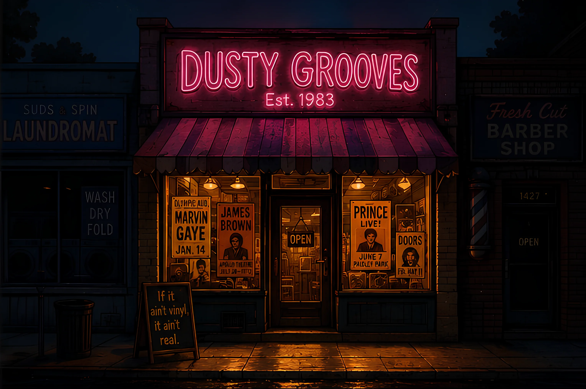
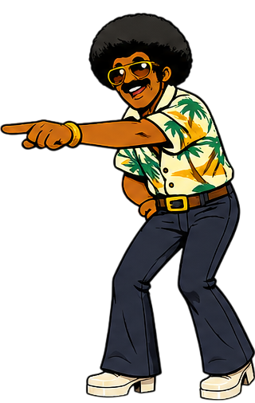
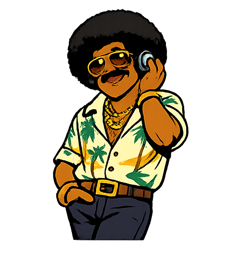
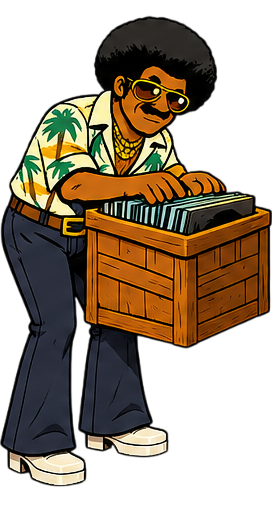
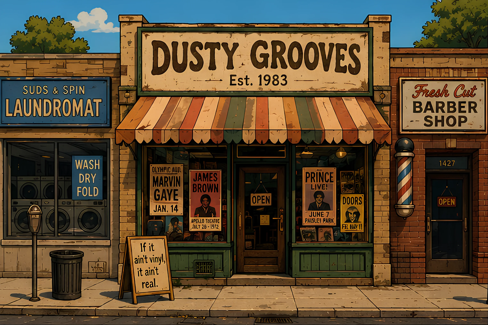
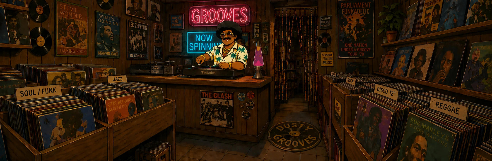

<p align="center">
  
</p>

<h1 align="center">Dusty Grooves</h1>
<h3 align="center">Est. 1983 - A record shop that time forgot</h3>

---

## The idea

Dusty Grooves is a browser music player disguised as an 80s record shop. Instead of building a standard interface with buttons and lists, I built the app around a character named Big Tony. 

The entire UI is driven by a React state machine. Every app state maps to one of Tony's poses and lines of dialogue. If you search for a song, Tony points to the wall and digs through the crates. If it plays, the vinyl slides onto the turntable and Tony listens. If a search fails, Tony just shrugs and tells you to try another track. There are no standard loading spinners or error modals, just Tony reacting to what the app is doing.

<p align="center">
  
  &emsp;&emsp;&emsp;&emsp;&emsp;
  
  &emsp;&emsp;&emsp;&emsp;&emsp;
  
</p>

## Day and Night

The app features a day and night toggle, but it is tied to the shop's environment rather than a standard dark/light mode theme. During the day, the sunlight hits the faded awning. At night, the hot pink neon sign glows and the street is dark.

<p align="center">
  
  
</p>

There are no accounts, no playlists, and no algorithms. You just walk in, search for a song, and listen.

## How the audio works

Finding reliable audio for a web app is hard, so I used the Last.fm API for track metadata and album art, and the YouTube Data API to actually play the music.

To keep the YouTube API key out of the frontend code, I set up a Cloudflare Worker to proxy the requests. Since a YouTube search often returns remixes, covers, or karaoke versions, the Worker scores the results before returning them. It gives points for exact title matches and official channels, and heavily penalizes words like "remix" or "live". If the top result does not pass a certain score threshold, the app refuses to play it and Tony tells you he cannot find that record.

Playback happens through a hidden YouTube iframe player forced to 240p to save bandwidth. 

## Tech stack

| Layer | Choice |
| --- | --- |
| Framework | React and Vite |
| Styling | Tailwind CSS and CSS keyframes |
| Metadata | Last.fm API |
| Audio | YouTube Data API v3 via Cloudflare Worker proxy |
| Hosting | GitHub Pages and GitHub Actions |

## Project structure

```text
dusty-grooves/
├── worker/
│   ├── index.js               <- Cloudflare Worker proxy
│   └── wrangler.toml          <- Worker deploy config
├── public/
│   └── images/                <- Big Tony poses and shop scenes
├── src/
│   ├── components/
│   │   ├── ShopExterior       <- The landing page
│   │   ├── ShopInterior       <- Inside the shop
│   │   ├── BigTony            <- State-driven character poses
│   │   ├── SpeechBubble       <- Typewriter effect for dialogue
│   │   ├── SearchResults      <- Records as cards with cover art
│   │   └── AudioEngine        <- Hidden YouTube iframe player
│   ├── hooks/
│   │   ├── useLastFm          <- Last.fm API calls
│   │   ├── useTrackSearch     <- YouTube search via Worker
│   │   └── useAppState        <- The state machine driving the UI
│   └── index.css              <- Palette, layout, and neon keyframes
├── .github/
│   └── workflows/
│       └── deploy.yml         <- GitHub Actions build and deploy
└── .env.example               <- Template for API keys
```

## Running it locally

1. Clone the repository and install the dependencies.
2. Head to the Last.fm API page to create a free account and grab your API key.
3. Go to the Google Cloud Console, enable the YouTube Data API v3, and create an API key.
4. Deploy the Cloudflare Worker using Wrangler to keep your YouTube key server-side.
5. Copy the `.env.example` file to `.env` and fill in your Last.fm key and your new Worker URL.
6. Run the dev server and open the shop.

---

<p align="center">
  
</p>

<p align="center">
  <i>If it ain't vinyl, it ain't real.</i>
</p>
